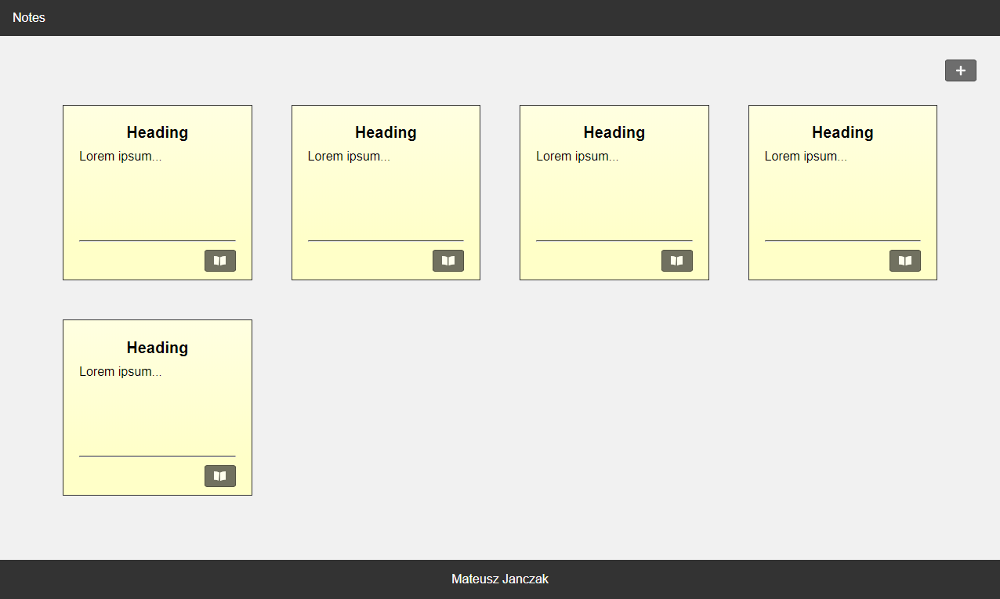

You can find the new improved version of the notepad [here](https://github.com/mateuszjanczak/notepad) (React + Redux + Typescript)

## ~~Notepad Client~~

~~App for note management.
To start, you need to run [notepad-service](https://github.com/mateuszjanczak/notepad-service) (back-end).~~

## ~~Preview~~

